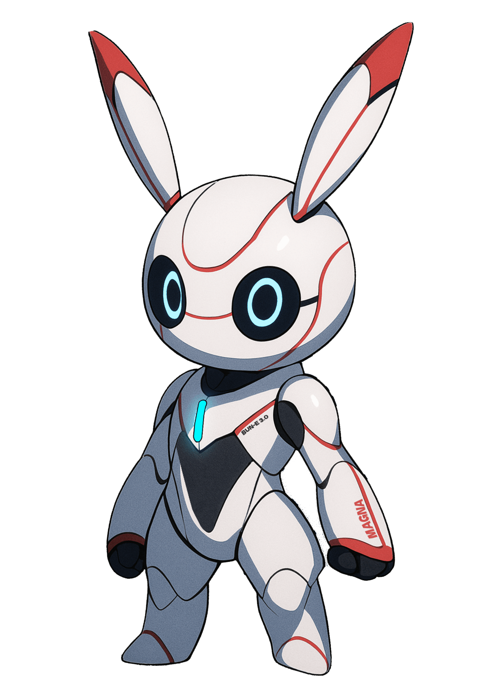

# Augma Life



## A Digital Wellness Companion

Augma Life is a Flutter-based wellness tracking application designed to help users monitor their daily activities, emotional state, and overall wellness. The app features a unique robotic avatar that reflects the user's energy levels in real-time.

## Features

### 🤖 Adaptive Avatar
- Interactive robotic avatar that changes appearance based on your energy level
- Visual representation of your emotional state with 5 different energy levels
- Personalized mantras that adapt to your current mood

### 📊 Health Metrics Tracking
- **Sleep**: Track sleep hours with optimal range guidance (5-8 hours)
- **Calories**: Monitor calories burned with energy rewards
- **Heart Rate**: Track heart rate with zone-based energy bonuses
- **Water**: Track water intake with hydration rewards
- **Work**: Log productive work hours
- **Reading**: Track reading progress by chapters

### ⚡ Energy System
- Dynamic energy calculation based on your daily activities
- Receive energy points for positive habits:
  - +10 energy per 100 calories burned
  - +10 energy per glass of water
  - +5 energy per work hour
  - +5 energy per chapter read
  - Energy bonuses based on heart rate zones
- Sleep quality affects energy (optimal range: 5-8 hours)

### 🔄 Daily Reset
- Fresh start every day with reset metrics
- Track your progress over time
- Establish healthy daily routines

## Getting Started

### Prerequisites
- Flutter SDK (latest stable version)
- Dart SDK
- Android Studio or VS Code with Flutter extensions

### Installation
1. Clone the repository
```bash
git clone https://github.com/yourusername/augma_life.git
```

2. Navigate to the project directory
```bash
cd augma_life
```

3. Install dependencies
```bash
flutter pub get
```

4. Run the app
```bash
flutter run
```

## Usage Guide

### Daily Tracking
- Add activities throughout your day by tapping the corresponding "+" buttons
- Watch your avatar transform as your energy level changes
- Use the emotion selector to manually indicate your current emotional state
- Save your progress with the save button in the top-right corner

### Energy Management
- Focus on maintaining optimal sleep (5-8 hours)
- Stay hydrated by tracking water intake
- Log your work hours for productivity tracking
- Record calories burned through exercise
- Track your reading habits by chapters completed

## Technology Stack
- Flutter
- Dart
- Google Fonts (Orbitron, Nunito)
- Custom animations
- Material Design 3

## Contributing
Contributions are welcome! Please feel free to submit a Pull Request.

## License
This project is licensed under the MIT License - see the LICENSE file for details.

## Acknowledgements
- Designed and developed as a personal wellness companion
- Inspired by the need for holistic health tracking in a single application
- Avatar design represents the blend of technology and wellness
